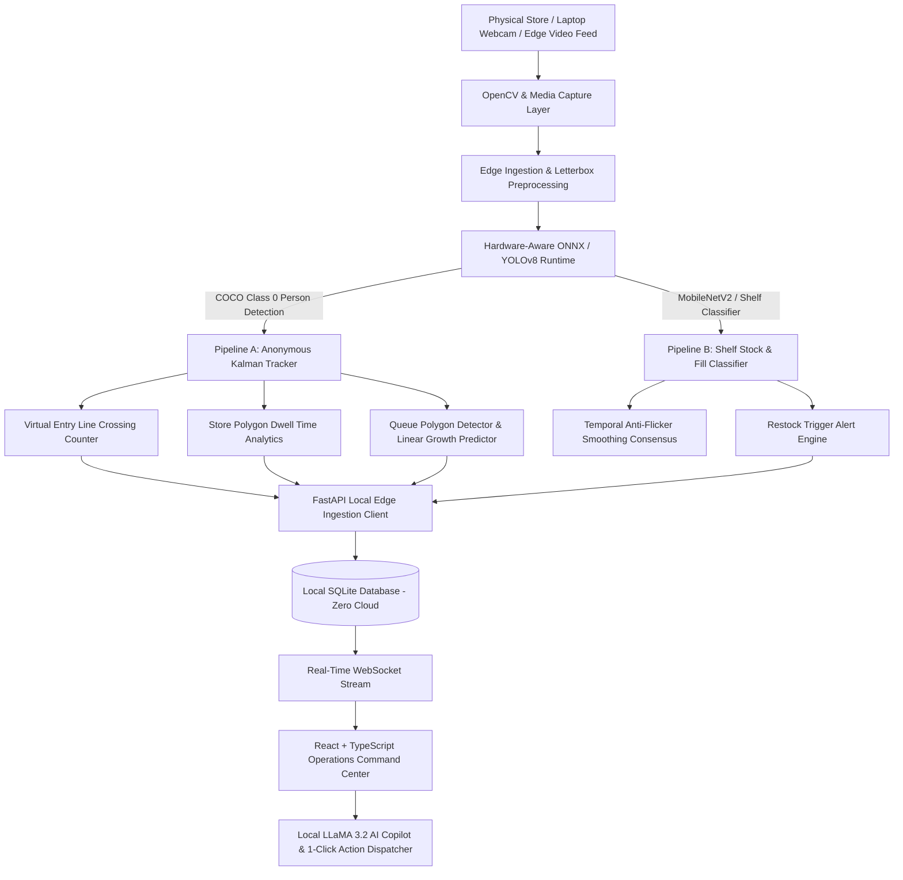

# ⚡ Nexora RetailIQ — Complete Run & Operations Guide

**Smart India Hackathon (SIH) 2026 | Problem Statement ID: SIH26-26179**  
**Theme**: Smart Automation & Retail Intelligence (100% On-Device Edge AI / Zero Cloud)  
**Team**: Nexora  

---

## 🌟 Executive Summary

**Nexora RetailIQ** is an edge-first, AI-powered **Retail Operations Command Center** designed for physical stores (supermarkets, grocery chains, department stores). It converts raw on-device computer vision and sensor telemetry into **prioritized, 1-click operational actions**:

1. **What needs my attention right now?** (e.g., *Checkout Counter 1 congested with 8 shoppers* or *Aisle 3 Dairy below 15% fill*).
2. **Why is it happening and how serious is it?** (Explainable queue growth rate $+1.8\text{ shoppers/min}$, estimated wait time $>6\text{ mins}$, high walkaway risk).
3. **What should I do about it?** (1-Click closed-loop resolution: `[ Open Cashier Counter 3 ]` or `[ Dispatch Restock Team ]`).

---

## 🏗️ System Architecture



---

## 💻 Tech Stack & Zero-Cloud Guarantee

| Domain | Technology / Tool | Role |
| :--- | :--- | :--- |
| **Frontend UI** | React 19, Vite, TypeScript, Lucide Icons, Vanilla CSS | Interactive Command Center, 2D Digital Twin, Live Webcam Node |
| **Backend API** | FastAPI (Python 3.10+), Uvicorn, Async SQLAlchemy, SQLite | REST APIs, Edge Ingestion, Event Streaming |
| **Edge Vision** | YOLOv8n (FP32 & INT8 ONNX), OpenCV, COCO-SSD | Multi-person detection, bounding boxes, queue tracking |
| **Local Copilot** | Local LLaMA 3.2 (Ollama / Local Inference) | Offline Natural Language Store Assistant |
| **Data Privacy** | 100% On-Device Local Processing | Zero video frames leave the store premises |

---

## 🚀 Step-by-Step Setup & Run Guide

### Prerequisites
- **Python**: 3.10 or higher
- **Node.js**: 18.0 or higher (with `npm`)
- **Webcam / Laptop Camera** (Optional for live camera demo)

---

### Step 1: Clone the Repository
```powershell
git clone https://github.com/bshubhayu07/Nexora-Retail.git
cd Nexora-Retail
```

---

### Step 2: Start the FastAPI Backend

Open a terminal in the project root:

```powershell
# 1. Install Backend Dependencies
pip install -r backend/requirements.txt
pip install ultralytics onnxruntime opencv-python numpy psutil pyyaml requests pillow

# 2. Seed Database with Initial Retail Records (Optional)
python backend/seed_data.py

# 3. Start the FastAPI Local Server
python backend/run.py
```
*Alternatively, start with uvicorn directly:*
```powershell
python -m uvicorn backend.app.main:app --host 127.0.0.1 --port 8000 --reload
```

* 🖥️ **FastAPI Server Running**: [http://127.0.0.1:8000](http://127.0.0.1:8000)
* 📜 **Interactive Swagger OpenAPI Docs**: [http://127.0.0.1:8000/docs](http://127.0.0.1:8000/docs)
* ⚡ **Live WebSocket Broadcast**: `ws://127.0.0.1:8000/ws/api/v1/dashboard/live`

---

### Step 3: Start the React + TypeScript Frontend

Open a second terminal window:

```powershell
# 1. Navigate to the frontend directory
cd frontend

# 2. Install Frontend Node Dependencies
npm install

# 3. Start the Vite Development Server
npm run dev
```

* 🌐 Open your browser at: **[http://localhost:5173/](http://localhost:5173/)**

---

## 👁️ Running Edge Computer Vision Feeds

### Option A: In-Browser Live Laptop Camera (Recommended for Demos)
1. Open the web app at **`http://localhost:5173/shoppers`**.
2. Click **`[ Connect Laptop Camera ]`** and allow camera permission.
3. The on-device neural network will detect everyone in front of the camera in real time, drawing responsive bounding boxes, tracking IDs, and calculating queue wait times ($45\text{s/person}$) directly inside the **Queue ROI Zone**!

### Option B: Python CLI Runner (`run_cv.py`)
Run the unified multi-source computer vision CLI:

```powershell
# Shopper & Queue Intelligence Pipeline (Demo Mode)
python run_cv.py --pipeline shopper --source demo --show

# Shopper Pipeline via Live Laptop Webcam
python run_cv.py --pipeline shopper --source webcam --show

# Shelf & Inventory Stock Pipeline
python run_cv.py --pipeline inventory --source demo --show

# Headless Background Execution (Both Pipelines)
python run_cv.py --pipeline all --source demo --headless
```

### Option C: Standalone Queue Worker (`cv-queue/detect_queue.py`)
```powershell
python cv-queue/detect_queue.py --source 0 --show
```

---

## 🎮 Five-Mode 2D Store Digital Twin Simulation

Under **Shopper Intelligence (`/shoppers`)**, switch between 5 interactive operational modes:

| Mode | Visual & Operational Behavior | Simulated Telemetry |
| :--- | :--- | :--- |
| **🟢 1. Standard Daytime Flow** | Smooth, balanced customer traffic wandering across aisles. | 18 Shoppers · Balanced 2-person queues at Counters 1 & 2 · Nominal. |
| **🚨 2. Evening Rush Peak Surge** | Rapid influx of shoppers forming a congested bottleneck at Counter 1 ($>7$ shoppers). | Queue Growth: $+1.8\text{ shoppers/min}$ · **`CRITICAL: OPEN COUNTER 3`**. |
| **🔥 3. Promotional Hotspot Rush** | Customer cluster congregates at Promotional Endcap Display Zone. | Dwell Time: $4.2\text{ min}$ avg · High promotional engagement. |
| **⚠️ 4. Dairy Stockout Crisis** | Rapid customer picking depletes Aisle 3 Dairy fill below $15\%$. | Fill Level: $14.5\%$ (3 cartons left) · **`WARNING: DISPATCH RESTOCK`**. |
| **⚡ 5. AI Closed-Loop Rebalanced** | Counter 3 is opened and restock team is dispatched. | Queue load redistributed · Stock refilled to $95\%$ · Fully resolved. |

---

## 🛡️ Zero-Cloud / Offline Verification Suite

Run the automated zero-cloud verification suite to prove 100% offline capability:

```powershell
python offline_test.py
```

```text
=================================================================
      NEXORA RETAIL - ZERO-CLOUD / OFFLINE VERIFICATION SUITE
=================================================================
  [PASS] Local Model Availability (yolov8n.onnx, shelf_detector.onnx)
  [PASS] Hardware Provider Fallback (DirectML / CPUExecutionProvider)
  [PASS] Anonymous Tracking (Zero PII, Persistent Track IDs)
  [PASS] Footfall Analytics (Cross-Product Virtual Entry Line)
  [PASS] Queue Analytics & Linear Trend Prediction (y = mx + b)
  [PASS] Shelf Temporal Consensus Smoothing (Anti-Flicker Filter)
  [PASS] Local SQLite Ingestion & WebSocket Broadcast
=================================================================
  >>> ZERO-CLOUD EDGE ARCHITECTURE FULLY VERIFIED (7/7 PASSED) <<<
=================================================================
```

---

## 📁 Repository Structure

```text
Nexora-Retail/
├── backend/                       # Production FastAPI Backend & SQLite DB
│   ├── app/
│   │   ├── api/v1/                # REST & WebSocket Endpoints (edge, queue, inventory, alerts)
│   │   ├── models/                # SQLAlchemy Domain Models
│   │   ├── schemas/               # Pydantic Request/Response Schemas
│   │   ├── services/              # Alert Engine, Copilot, Simulator, WebSocket Manager
│   │   ├── database.py            # SQLite Connection & Session Manager
│   │   └── main.py                # FastAPI Application Entry
│   ├── requirements.txt           # Python Dependencies
│   └── run.py                     # Local Server Launcher
├── frontend/                      # Production React + TypeScript SPA
│   ├── src/
│   │   ├── api/                   # Typed Backend API Clients & WebSocket Hook
│   │   ├── components/            # Reusable Command Center UI Components
│   │   │   ├── command-center/    # Situation Hero, Attention Queue, Recent Activity
│   │   │   ├── inventory/         # Inventory Table, Restock Queue, Aisle Drawer
│   │   │   ├── queue/             # Cashier Counter Cards, Queue Drawer
│   │   │   ├── shoppers/          # Live Laptop Webcam Feed, 2D Digital Twin, Heatmap
│   │   │   ├── copilot/           # Local LLaMA 3.2 Chat Assistant
│   │   │   └── system/            # Qualcomm Hardware Diagnostics & Simulator Controls
│   │   ├── context/               # Global Real-Time Store State & Toast Context
│   │   ├── pages/                 # Full-Page Routed Views
│   │   └── styles/                # Vanilla CSS Theme Tokens & Design System
│   ├── package.json
│   └── vite.config.ts
├── cv_edge/                       # Core Edge Computer Vision Layer
│   ├── analytics/                 # Footfall, Dwell Time, Queue Predictor, Shelf Status
│   ├── models/                    # ONNX Detectors (FP32 & INT8 Quantized)
│   ├── pipelines/                 # Shopper & Inventory End-to-End Pipelines
│   └── tracking/                  # Anonymous Kalman Multi-Object Tracker
├── cv-queue/                      # Standalone Camera Queue Detection Scripts
│   ├── detect_queue.py            # YOLOv8 Camera Ingestion Worker
│   └── shelf_classifier.py        # MobileNet Shelf Classifier Worker
├── models/                        # Local ONNX Model Files (Zero Cloud)
├── tests/                         # Automated Pytest Suite
├── run_cv.py                      # Unified CV CLI Runner
├── benchmark.py                   # On-Device Hardware Benchmark Suite
├── offline_test.py                # Zero-Cloud Offline Verification Script
└── RUN_GUIDE.md
```

---

## 🔒 Privacy & Ethics Compliance

1. **Zero Biometrics / PII**: No facial recognition, face cropping, or biometric matching is ever performed. Detection is strictly restricted to COCO Class 0 (`person`).
2. **Ephemeral Session IDs**: Tracking IDs (`Person 1`, `Person 2`...) exist only in local memory during an active visit to calculate dwell times and line crossings.
3. **Zero Video Uploads**: Video frames are processed in volatile memory on the edge device and immediately discarded. Only numerical telemetry (headcounts, fill percentages) is stored locally.

---

## 🏆 Smart India Hackathon 2026

**Team**: Nexora  
**Problem Statement**: SIH26-26179 | Smart Automation (Edge AI Retail Intelligence)  
*Built for 100% offline edge execution on Qualcomm Snapdragon & standard laptops.*
